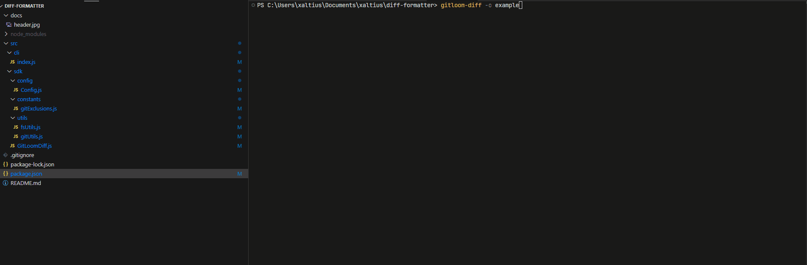

<div align="center">


# GitLoom Diff

[](https://www.npmjs.com/package/gitloom-diff)
[](https://opensource.org/licenses/MIT)
[](https://nodejs.org)

**Stop squinting at those git provider diff views.**
<br>
Generate beautiful, searchable, IDE-friendly git diffs in markdown format.
<br>
<br>

</div>

<br>

> ⚠️ **Early Stage Project**: GitLoom Diff is currently in active development and not yet production-ready. Expect frequent breaking changes and major updates as we evolve the tool. Use with caution in production environments.

## Quick Start

```bash
npm install -g gitloom-diff

# Basic usage
gitloom-diff 

# Compare branches
gitloom-diff -s feature/awesome -e main
```

## Why You'll Love This

GitHub, GitLab, or any other git provider diffs are often overwhelming - endless scrolling, no search, and hard to navigate between files. This tool generates clean markdown diffs that you can:

- 🚀 **Open in Your Favorite IDE/Editor**
  - Use your IDE's search & navigation
  - Navigate diffs with familiar codebase structure (follows original file paths)
  - Get proper syntax highlighting
  - Review diffs comfortably

- 🤖 **Feed Directly to AI**
  - Share diffs directly with any LLM (e.g. ChatGPT, Claude, etc)
  - Review changes with integrated AI in your preferred editor (No more copy-paste hell)
  - Let AI help you:
    - Generate PR summaries instantly
    - Generate commit messages, changelog, or release notes from changes
    - Get code review suggestions and explanations
    - Analyze changes for potential bugs and improvements

- 🧹 **Focus on What Matters**
  - Auto-skips node_modules, build files, and junk
  - Shows only relevant changes
  - Customize exclusion patterns

- 📤 **Share & Reference**
  - Share clean diffs with team members and stakeholders
  - Attach as context in tickets and documentation
  - Create permanent snapshots of changes for future reference
  - Use in async discussions and code reviews

## Core Features

- 💡 **Compare Anything**: branches (local or remote), commits, tags
- 📊 **Rich Statistics**: changes per file, summaries, commit history
- 📝 **Markdown Output**: readable, searchable, navigable, shareable

## Output Structure

```
📁 git-diffs/
├── 📊 DIFF_INDEX.md     # Overview of all changes
├── src/
│   ├── 📝 api.js.md    # Per-file diffs with syntax highlighting
│   └── components/
│       └── 📝 Button.js.md
```

### Sample Diff Output

```markdown
# Changes in `src/components/Button.js`

## File Statistics
 src/components/Button.js | 25 +++++++++++++++++--------

## Changes
```diff
- import React from 'react';
+ import React, { useState } from 'react';

 const Button = ({ label }) => {
+  const [isHovered, setIsHovered] = useState(false);
```

## Usage

### Basic Commands

```bash
# Compare branches (PR mode - default)
gitloom-diff -s feature/branch -e main

# Compare tags (use tag mode)
gitloom-diff -s v1.1.0 -e v1.0.0 -m tag

# Compare commits (use commit mode)
gitloom-diff -s abc123 -e def456 -m commit

# Compare with remote
gitloom-diff -s origin/main -e main

# Compare staged changes
gitloom-diff -s HEAD -e --staged
```

### Configuration

```bash
Options:
  -s, --start-ref <ref>      Starting reference (newer state)
  -e, --end-ref <ref>        Ending reference (older state)
  -o, --output <dir>         Output directory (default: "git-diffs")
  --exclude <patterns...>    Additional file patterns to exclude
  -m, --mode <mode>         Comparison mode: pr|commit|tag (default: "pr")
  --light-mode              Use light mode theme
  -h, --help                Display help
```

### Advanced Examples

```bash
# Tag comparison
gitloom-diff -s v2.0.0 -e v1.0.0 -m tag

# Exclude patterns with commit comparison
gitloom-diff -s abc123 -e def456 -m commit --exclude "*.test.js" "docs/**"

# Multiple options
gitloom-diff \
  -s feature/new-ui \
  -e develop \
  -m pr \
  -o ui-changes \
  --exclude "*.test.js" "*.snap" \
  --light-mode
```

## Programmatic Usage

```javascript
const GitLoomDiff = require('gitloom-diff');

const differ = new GitLoomDiff({
  outputDir: 'custom-dir',
  exclusions: ['*.log'],
  darkMode: false,
  mode: 'pr'
});

await differ.run('main', 'feature/branch');
```

### Integration Examples

```javascript
// Code Review Tool Integration
async function generateReviewDiff(prNumber) {
  const differ = new GitLoomDiff({
    outputDir: `pr-${prNumber}-diff`,
    mode: 'pr'
  });
  await differ.run('main', `pr-${prNumber}`);
}

// Git Hook Integration
async function preCommitHook() {
  const differ = new GitLoomDiff({
    mode: 'commit'
  });
  await differ.run('HEAD', '--staged');
}

// Tag Release Comparison
async function compareReleases(oldTag, newTag) {
  const differ = new GitLoomDiff({
    mode: 'tag',
    exclusions: ['*.lock', 'dist/*']
  });
  await differ.run(newTag, oldTag);
}
```

## Auto-Excluded Files

- Package manager locks (package-lock.json, yarn.lock)
- Dependencies (node_modules/, vendor/)
- Build outputs (dist/, build/, .next/)
- IDE and OS files (.idea/, .vscode/, .DS_Store)
- Logs and environment files

## Requirements

- Node.js >= 18
- Git installed and accessible

## Contributing

1. Fork and clone
2. `npm install`
3. Create feature branch
4. Make changes
5. Submit PR

## Troubleshooting

### Common Issues

1. **Git Command Fails**
   - Ensure you're in a git repo
   - Check git installation
   - Verify git config

2. **No Output**
   - Verify changes exist
   - Check exclusion patterns
   - Confirm git range

3. **Exclusion Issues**
   - Use forward slashes
   - Escape wildcards
   - Use `dir/**` for directories

## License

MIT

## Acknowledgments

Built with:
- [commander](https://www.npmjs.com/package/commander)
- [ora](https://www.npmjs.com/package/ora)